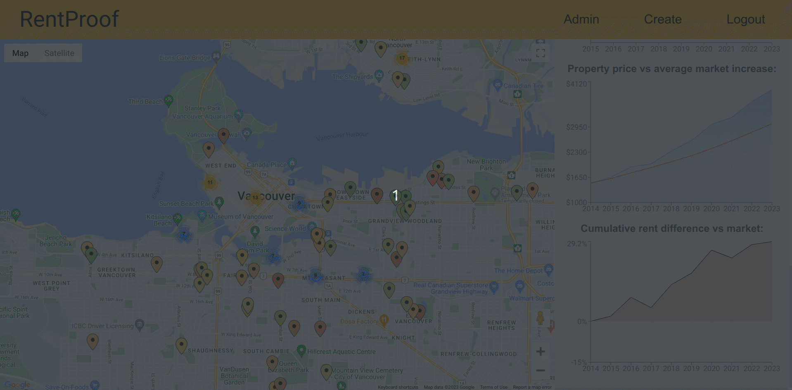

# RentProof

**RentProof is a rent accountability app that tracks user-supplied market data.**

The idea behind this project is that unbiased members of the public will contribute their rental price data to the app so that a detailed history of rental prices can be established for indivdual properties and regional markets. This empowers renters by providing them with a single repository for rental price data so they can quickly identify high-performing from low-performing properties over time.   

## Project Screenshots

### Home Page


### Colour Coded Markers



### Add Price


### Admin Approval


## Tech Stack


## Installation

1. Clone this repository.
```$ git clone https://github.com/JackDuluoz/RentProof```

2. Run `npm install` from the root directory of the project.

3. Run `npm install` from inside the client directory.

```bash
$ cd RentProof
$ npm install
$ cd client
$ npm install
```

4. Set environment variables.

  Create a `.env` file in the client directory and insert your own placeholder values.

```bash
REACT_APP_GOOGLE_MAPS_API_KEY=<GOOGLE API KEY>
```

5. Start the back end from the root directory of the project.
`$ npm run dev`

6. Start the front ent from inside the client directory.
`$ npm start`

## Author

Michael Green [@michaelgreen](https://github.com/JackDuluoz)

## Acknowledgements

Built with [James Brown](https://github.com/jamesraymondbrown) and [Hadley Sutherland](https://github.com/Vuvvy1). We had a lot of fun putting this together!